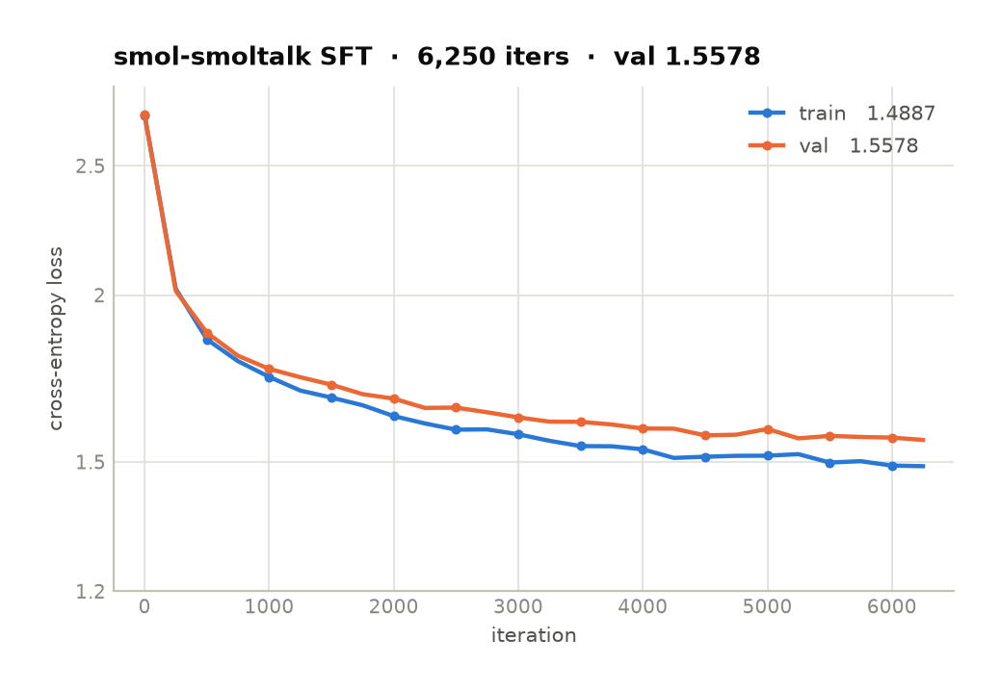
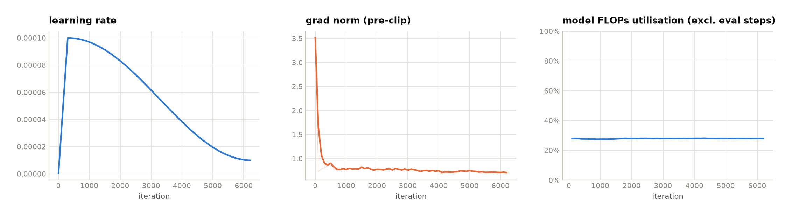

# TinyLM

This is an educational repo for getting hands-on with implementing, training, and evaluating
language models.

A 50.9M-parameter GPT trained from scratch — tokenizer to sampling to chat fine-tuning —
in ~1,300 lines of readable PyTorch. No `transformers`, no Lightning, no config framework.
Two corpora are set up out of the box: **TinyStories**, which a model this size can
actually learn to write well, and **FineWeb-Edu**, where the same model gets to fluent
English and stops short of anything you would call knowledge. The FineWeb-Edu checkpoint
then gets supervised fine-tuning on **smol-smoltalk** to turn it into a chat model — which
teaches it the shape of an answer without giving it anything true to say.

Pretraining runs on one consumer GPU: both from-scratch runs trained on a single RTX 3090
at a sustained **71% MFU** — about 52 TFLOP/s of its 71 TFLOP/s bf16 peak. The SFT run was
done on an L40S.

## Results


| | TinyStories | FineWeb-Edu |
|---|---|---|
| context length | 512 | 1024 |
| tokens per optimizer step | 131,072 | 262,144 |
| iterations | 8,000 | 20,000 |
| tokens seen | 1.05B (2.21 epochs) | 5.24B (0.55 epochs) |
| best val loss | **1.3186** @ iter 7,500 | **3.3579** @ iter 20,000 |
| train/val gap at the end | 0.038 | 0.022 |
| MFU | 71.0% | 71.3% |
| wall clock | ~1.9h | ~10.3h |

Neither run overfits: the train/val gap stays under 0.04 nats throughout, so both were
still improving when they stopped. Per-eval numbers are in
[assets/metrics-tinystories.csv](assets/metrics-tinystories.csv) and
[assets/metrics-fineweb-edu.csv](assets/metrics-fineweb-edu.csv).

### Supervised fine-tuning



Starting from the FineWeb-Edu checkpoint, three epochs over
[smol-smoltalk](https://huggingface.co/datasets/HuggingFaceTB/smol-smoltalk) — 451,284
conversations, the SmolTalk variant built for models under 1B:

| | smol-smoltalk SFT |
|---|---|
| initialised from | FineWeb-Edu @ iter 20,000 |
| conversations / tokens | 451,284 / 273.5M (78.3% supervised) |
| tokens per optimizer step | 131,072 |
| iterations | 6,261 (3.00 epochs) |
| val loss, before any SFT | 2.7307 |
| best val loss | **1.5578** @ iter 6,250 |
| train/val gap at the end | 0.069 |
| MFU (L40S) | 27.9% |
| wall clock | ~0.9h |

The 2.7307 → 1.5578 drop is the honest measure: both numbers are the same model family
scored on the same chat corpus, before and after. The pretraining val loss of 3.3579 is
*not* comparable — that was FineWeb-Edu, a different distribution entirely.

Still no overfitting at 3 full epochs — the gap ends at 0.069 and val was flat rather than
rising, so the ceiling here is corpus size and model capacity, not optimisation. MFU is
27.9% against the L40S's 362 TFLOP/s bf16 peak, well below pretraining's 71%: at 131,072
tokens per step against pretraining's 262,144, per-step overhead simply gets a bigger share.
Per-eval numbers are in
[assets/metrics-smol-smoltalk-sft.csv](assets/metrics-smol-smoltalk-sft.csv).


### HellaSwag

The FineWeb-Edu checkpoint, zero-shot over all 10,042 validation examples, split by the
two sources HellaSwag draws from:

| | n | acc | acc_norm | correct-ending loss | margin |
|---|---|---|---|---|---|
| activitynet | 3,243 | 0.3235 | **0.3290** | 3.6615 | **+0.2134** |
| wikihow | 6,799 | 0.2484 | 0.2455 | 3.2759 | −0.0120 |
| **overall** | 10,042 | 0.2727 | 0.2725 | 3.4004 | +0.0608 |
| random baseline | | 0.2500 | 0.2500 | | 0 |

### Training dynamics


Cosine decay from 6e-4 to 6e-5 after 500 warmup iterations. The pre-clip gradient norm is
the trace worth watching: it settles to ~0.45 and stays flat, comfortably under the 1.0
clip, so the clip is not what is holding the run together. MFU sits at 71% for the whole
run with no thermal or memory-pressure drift.

The TinyStories run behaves the same way at half the context length — same schedule shape,
gradient norm settling near 0.31, and the same 71% utilisation:


The SFT run has the same shape at a sixth of the peak learning rate — 1e-4 to 1e-5 after
300 warmup iterations — but its gradient norm tells a different story:



It opens at **3.51**, four times anything the pretraining runs ever see, then falls to ~0.75
within a few hundred iterations and stays there. That spike is the two chat delimiters:
`<|im_start|>` and `<|im_end|>` are re-initialised from noise while every other weight
arrives pretrained, so the first gradients are dominated by two embedding rows that are
badly wrong. It is also the clearest argument for keeping a warmup on a fine-tuning run —
without one, those first steps land at full learning rate.

## Samples

**TinyStories**, unconditional, temperature 0.8:

> Once upon a time, there was a little girl named Lily. She had a magical lamp that made
> all her wishes come true. One night, when Lily was looking up at her lamp, she noticed
> it was starting to glow.
>
> Lily was surprised and asked her mom, "Mommy, what is happening?"
>
> Her mom replied, "I don't know, sweetie. It's unknown."
>
> Lily was confused and asked, "What do you mean, mommy?"
>
> Her mom explained, "When things are unknown, just like you and your lamp. They can't be
> found because they have lost forever."

Prompted with *"Once upon a time, there was a little robot who"*:

> …wanted to design something special. He found a big bag of buttons and he thought that
> it would be perfect.
>
> The robot said to the box, "I will make something special with these buttons and it will
> be perfect!" The box replied, "What would it be?" The robot was so excited and he said,
> "I will make a cool surprise!"
>
> The robot worked hard and soon he had designed a beautiful toy robot. The robot's eyes
> were bright and he was so proud of his work.

Coherent characters, consistent tense, and a story that resolves. That is what a 50M model
gets you when the corpus is narrow enough.

**FineWeb-Edu**, same settings — the contrast is the point:

> When you visit the site, you can be sure to make sure that you are answering all your
> questions at the same time. When you go to the site, you can be sure that you are
> answering your questions. […] Why do we need to visit the site? Why can I visit the site
> more often? Why do we need more time?

Grammatical and locally fluent, but it loops and has nothing to say. At 3.36 val loss on
open web text the model has learned English syntax and no world model to speak of.

**After SFT**, same checkpoint, temperature 0.7. *"Why is the sky blue?"*:

> The sky blue, also known as the blue sky due to the unique combination of colors known
> as the blue color pattern, is a common phenomenon in the Earth's atmosphere. […] As the
> Earth's atmosphere absorbs blue and becomes more saturated with oxygen, the blue color
> of the atmosphere becomes red. […] This phenomenon is often referred to as the "oxygen
> cycle" or "blue sky."

*"How do I make scrambled eggs?"*:

> To make scrambled eggs, you need to use the egg yolk, which is a natural starter that can
> be applied to a variety of eggs. Start by mixing eggs from different types of eggs, such
> as whites, cream, and butter. […] Place the eggs in a well-stocked container and let them
> rest for about a few hours to allow them to sit for a few hours.

The form is right and the content is invented. It answers in the register of a helpful
assistant — opening restatement, structured middle, an "it's worth noting that" hedge —
and every sample terminates on its own by emitting `<|im_end|>` rather than running to the
token limit. That stop token is the one thing SFT reliably teaches, and it is worth being
precise about why: of a 1,024-token training window only the assistant's turns carry loss,
and the closing `<|im_end|>` is the last supervised token of every one of them.

What SFT cannot do is add knowledge that was never there. The 3.36 val loss on FineWeb-Edu
did not move; only the packaging changed. Occasionally the pretraining corpus does show
through — *"What is the capital of France?"*:

> French capital of France is Paris, a city known for its historical landmarks and cultural
> significance. It is located on the southern bank of the Seine River, approximately 597 km
> from the mouth of the Seine River. Paris, a city in the heart of France, is famous for its
> iconic landmarks like the Eiffel Tower and the Louvre Museum.

Paris, the Seine, the Eiffel Tower and the Louvre are all real and all correctly associated
— that is FineWeb-Edu surfacing. The city straddles the Seine rather than sitting on its
southern bank, and the 597 km is invented. Right facts, confabulated specifics, delivered
with identical confidence: a compact illustration of what instruction tuning does and does
not buy you.

## Architecture

A decoder-only transformer, pre-norm, in [model.py](model.py):

| | |
|---|---|
| parameters | 50,930,176 |
| layers / heads / d_model | 8 / 8 / 512 |
| feed-forward dim | 2048 |
| context length | 1024 (512 for the TinyStories run) |
| vocab | 50,304 (GPT-2 BPE, padded to a multiple of 64) |
| normalization | pre-norm LayerNorm, no bias |
| positional encoding | learned |
| attention | `F.scaled_dot_product_attention` (FlashAttention) |
| weight tying | input embedding ↔ output head (saves 12.9M params) |

The parameter count excludes the position embedding and counts the tied
embedding once, so it is identical across both context lengths.

Trained in bfloat16 autocast under `torch.compile`, batch 16 × 1024 tokens ×
16 gradient-accumulation steps = **262,144 tokens per optimizer step**. AdamW,
β = (0.9, 0.95), weight decay 0.1 on matmul parameters only — 1-D gains, biases
and embeddings are excluded — and gradient clip 1.0.

## Usage

With [uv](https://github.com/astral-sh/uv):

```bash
uv venv
uv pip install -r requirements.txt
source .venv/bin/activate          # or prefix each command with `uv run`
```

Or with the standard library:

```bash
python -m venv .venv && source .venv/bin/activate
pip install -r requirements.txt
```

**Tokenize a corpus** into `data/<dataset>/` — flat `uint16` token shards plus a
`meta.json` manifest. Streams FineWeb-Edu rather than landing 45GB of arrow on disk, and
resumes at the last shard boundary if interrupted:

```bash
python prepare.py tinystories          # ~475M tokens, a few minutes
python prepare.py fineweb-edu          # ~9.7B tokens (sample-10BT), a few hours
```

**Train.** Data and checkpoints are namespaced per dataset, so runs on different corpora
never collide:

```bash
python train.py --dataset tinystories
python train.py --dataset fineweb-edu --resume
tensorboard --logdir out/fineweb-edu/tb
```

Hyperparameters are module-level constants at the top of [train.py](train.py) — edit them
there. On resume the architecture comes from the checkpoint, not from the constants.

**Sample:**

```bash
python sample.py --ckpt out/tinystories/ckpt.pt \
                 --prompt "Once upon a time" --num_samples 3 --temperature 0.8
```

**Supervised fine-tuning** on [smol-smoltalk](https://huggingface.co/datasets/HuggingFaceTB/smol-smoltalk)
— the SmolTalk variant built for models under 1B, with the advanced math and function-calling
subsets removed:

```bash
python prepare_sft.py                          # 451k conversations, 273.5M tokens
python prepare_sft.py --max-examples 50000     # or a slice, to check the pipeline first
python sft.py                                  # starts from out/fineweb-edu/ckpt.pt
python sample.py --ckpt out/smol-smoltalk-sft/ckpt.pt --prompt "Why is the sky blue?"
```

Three things make this different from pretraining:

*Chat tokens cost nothing.* `vocab_size` is GPT-2's 50257 padded to 50304, so ids 50257
and 50258 are rows the embedding matrix already has and has never used. They become
`<|im_start|>` and `<|im_end|>` with no resize and no checkpoint surgery. Tied to `lm_head`,
those rows spent pretraining being pushed down by the softmax denominator, so `sft.py`
resets them to the init distribution before training.

*Loss is masked to assistant turns.* [prepare_sft.py](prepare_sft.py) writes a `uint8` mask
beside every token shard, and [sft.py](sft.py) turns unmasked positions into `-100` for
`ignore_index`. The model is graded on what it should say, not on reciting the question back.

*Batches start at conversation boundaries.* A third shard file holds the `uint64` offset of
every conversation, so a window never opens midway through an assistant turn with the prompt
that produced it out of view. Conversations too long for `block_size` are cut back to the last
complete turn rather than dropped, which is why the corpus survives the 1024-token window
nearly intact: **451,284 of 460,341** conversations, 98.0%. Dropping them whole instead kept
57% on the sample this was measured against.

**Evaluate on HellaSwag:**

```bash
python hellaswag.py --ckpt out/fineweb-edu/ckpt.pt
python hellaswag.py --chunk 8          # lower if 24GB is not enough
```

Downloads the 47MB validation split on first run. Peak memory is the float32 logits, so
`--chunk` bounds it independently of `--batch`.

**Regenerate the figures and CSVs in `assets/`** from the TensorBoard event files:

```bash
python plot.py
```

## Repository layout

| file | |
|---|---|
| [model.py](model.py) | GPT definition, MFU estimator, optimizer grouping |
| [prepare.py](prepare.py) | corpus → resumable `uint16` token shards + manifest |
| [train.py](train.py) | training loop, cosine schedule, TensorBoard, checkpointing |
| [chat.py](chat.py) | ChatML rendering on GPT-2 BPE, conversation → tokens + loss mask |
| [prepare_sft.py](prepare_sft.py) | chat corpus → token / mask / conversation-index shards |
| [sft.py](sft.py) | masked-loss fine-tuning from a pretrained checkpoint |
| [sample.py](sample.py) | autoregressive generation with temperature / top-k |
| [hellaswag.py](hellaswag.py) | zero-shot HellaSwag by length-normalized likelihood |
| [plot.py](plot.py) | TensorBoard events → `assets/` figures and CSVs |